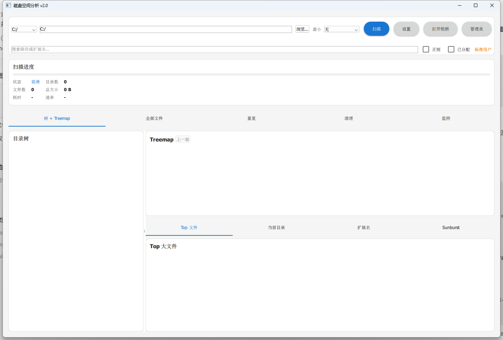

# CleanerQt

[](https://github.com/th000cw02-afk/cleaner_qt/actions/workflows/build.yml)
[](LICENSE)
[](https://www.qt.io/)
[](https://github.com/th000cw02-afk/cleaner_qt)

**[中文文档](README.zh-CN.md)**

Fast Windows disk space analyzer with NTFS MFT scanning, interactive treemap, 12 cleanup scanners, and a headless CLI. Built with Qt 6 and C++17.

## Screenshots

### Disk usage at a glance

Directory tree + squarified treemap with extension coloring and drill-down navigation.



### Cleanup Hub

12 Scour-style scanners to find empty directories, duplicates, large files, temp files, and more.


### All Files view

Virtual-scrolled flat file index with sorting, filtering, and regex search.


### Dark theme

Material Design dark/light themes with customizable accent colors.


## Features

- **NTFS MFT fast scan** (admin) with automatic fallback to parallel directory walk
- Directory tree + **squarified treemap** (extension colors, file-level blocks, drill-down)
- **All Files** flat view with virtual scrolling (`FileIndexModel`)
- Logical vs **allocated** size, hard-link registry
- Scan snapshots (`.cqtscan`) save/load
- Dedicated duplicates page, regex search, multi-select batch delete
- **Cleanup Hub**: 12 Scour-style cleanup scanners
- Dark/light theme, settings dialog (exclusions, MFT preference, portable mode)
- Scan rate (GB/s), progress, UAC elevation restart
- **CLI**: `CleanerQt.exe --scan C:\ --format csv --output r.csv --mft`
- Sunburst alternate view, Top Files, extension stats

## Inspired by

| Project | What we borrowed |
|---------|------------------|
| [QDirStat](https://github.com/shundhammer/qdirstat) | Tree + treemap, extension legend, custom cleanup |
| [WinDirStat](https://github.com/windirstat/windirstat) | Multi-view, snapshots, hard links, CLI |
| [DiskPilot](https://github.com/mhkasif/DiskPilot) | Virtual scroll, allocated/logical, column persistence |
| [Scour](https://github.com/SysAdminDoc/Scour) | 12 cleanup scanner types |
| [DiskClarity](https://github.com/Ezeny1337/DiskClarity) | MFT performance baseline |

## Quick start

Download the latest **Release** from [GitHub Releases](https://github.com/th000cw02-afk/cleaner_qt/releases), extract the full `Release` folder (not just the `.exe`), and run `CleanerQt.exe`.

> Run as **Administrator** on NTFS volumes to enable MFT fast scan.

## Requirements

- Windows 10/11
- Qt 6.5+ (Core, Quick, Qml, Widgets, Concurrent, Network)
- CMake 3.16+
- MSVC 2022 or MinGW 64-bit

## Build

```powershell
cd build
cmake .. -DCMAKE_PREFIX_PATH="C:\Qt\6.8.0\msvc2022_64"
cmake --build . --config Release
cmake --build . --target deploy-release --config Release
```

Or use the deploy script:

```powershell
.\scripts\deploy.ps1
```

`windeployqt` copies `Qt6Widgets.dll`, `Qt6Quick.dll`, `platforms\`, etc. next to the executable. **Do not distribute the `.exe` alone** — ship the entire `public/Release` folder.

Output: `public/Release/CleanerQt.exe`

## CLI

```powershell
CleanerQt.exe --scan D:\ --output scan.csv --format csv --mft
CleanerQt.exe --import-csv scan.csv
CleanerQt.exe --scan D:\ --verbose
```

## Keyboard shortcuts

| Key | Action |
|-----|--------|
| F5 | Start scan |
| Ctrl+S | Save scan snapshot |
| Ctrl+F | Focus search |

## Logging

Uses [spdlog](https://github.com/gabime/spdlog) when available: place sources under `third_party/spdlog`, or pass `-DCLEANER_QT_FETCH_SPDLOG=ON` at configure time. Falls back to built-in file logging otherwise. Output: console + rotating file (`logs/CleanerQt.log`, 5 MB × 3 files).

## Testing

~20 unit and integration tests (Qt Test + CTest):

```powershell
.\scripts\test.ps1
```

Disable tests: `cmake -DCLEANER_QT_BUILD_TESTS=OFF ..`

Benchmark notes: [`tests/benchmark/README.md`](tests/benchmark/README.md)

## Roadmap / WIP

The following modules are registered but not yet implemented (return empty results):

- Broken links scanner
- Duplicate archives scanner
- Orphaned app data (uninstall leftovers)

The **File Watcher** tab is a UI placeholder.

## Contributing

See [CONTRIBUTING.md](CONTRIBUTING.md). Bug reports and feature requests welcome via [GitHub Issues](https://github.com/th000cw02-afk/cleaner_qt/issues).

## Security

This tool can delete files and request administrator elevation. See [SECURITY.md](SECURITY.md) for responsible disclosure.

## License

GPL-3.0 — see [LICENSE](LICENSE). Copyright (C) 2026 [th000cw02-afk](https://github.com/th000cw02-afk).
